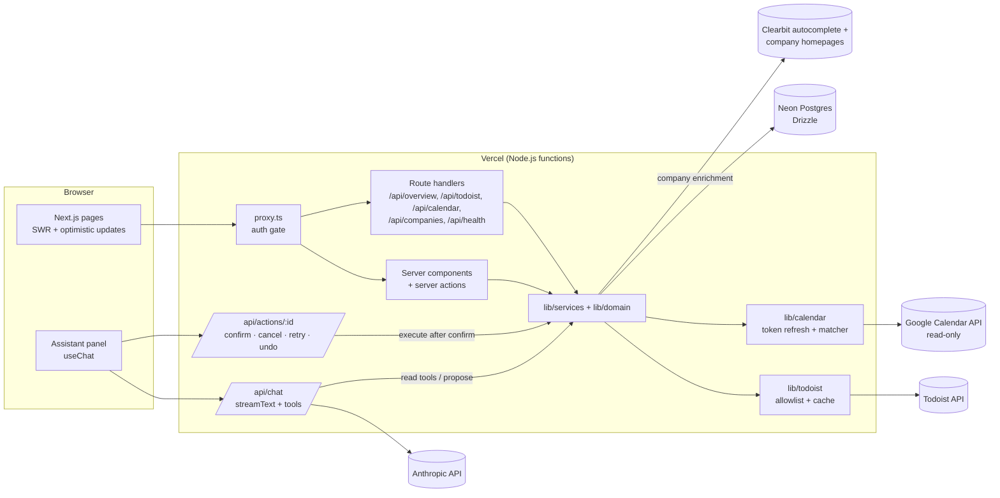

# Your Personal Productive Workspace

A private, single-user dashboard for running a job search. It answers one question at a glance — **"what's the next thing I should do?"** — for each area of the search (positioning, applications, networking, interview prep, company research, side income, personal development).

- **Todoist is the source of truth for tasks.** The dashboard reads and writes tasks only inside the Todoist projects/sections mapped to its groups. The Inbox and unmapped projects can be read by the assistant but never changed.
- **Google Calendar is read-only.** Time blocks are matched to groups by title so the home page can show what you're scheduled to work on *now*.
- **Postgres (Neon) holds everything else:** applications, contacts and touches, companies, interviews, prep, side-income options, focus items, weekly targets and reviews, chat history, and pending assistant actions.
- **An AI assistant** (Claude via the Vercel AI SDK) can read everything and propose changes. Every write is shown as a confirmation card and **nothing changes until you confirm**. Confirmed actions can be undone.

Sign-in is Google via Auth.js, restricted to a single allowlisted email.

## Features

- **Home:** a week calendar with an hour axis (Mon–Sun, previous/next week; a single-day view with a day picker on narrower screens). Google Calendar events and timed Todoist tasks are placed at their real times (overlaps side by side, with a red now line), while all-day events and tasks without a time sit in an "All day" row. Click an event to see its Google Calendar description and a link to its group. Tasks come only from dashboard groups, never the Inbox or other personal projects; overdue tasks show under today and can be completed in place. Below it, a "Now" banner from the current calendar block, one card per group with its next step, overdue/due-today counts, and weekly-target warnings.
- **Group pages:** this week's calendar blocks linked to the group (by its calendar-title rule) with their descriptions, planned vs. elapsed hours and a "Now" marker; the task tree for that group (complete, reschedule, skip for today, mark as next, quick add) plus a context panel depending on the group's kind:
  | Kind | Panel |
  |---|---|
  | `pipeline` | Applications board/table with stages, plus each company's tier badge |
  | `people` | Contacts, follow-up due dates, touch logging |
  | `prep` | Interviews, prep sessions, question bank, STAR stories |
  | `research` | Companies grouped by tier (Tier 1 = most attractive, Tier 2, Tier 3, Unrated) with tier filters and a one-click tier picker; name autocomplete fills in the website, logo and a homepage description; "Ready to apply" creates a linked task in Applications |
  | `options` | Side-income options, hours logged vs. weekly cap |
  | `focus` | Personal-development items, max 2 active |
- **Scorecard:** Monday–Sunday weekly metrics (in `APP_TIMEZONE`) vs. targets, per-week overrides, chart, and a weekly review form.
- **Settings:** groups (Todoist mapping, calendar-title rules, colour, icon, order, archive), default targets, connection status, theme (Light / Dark / System).
- **Freshness:** SWR polling (~30 s) plus revalidate on tab focus; Todoist responses are cached briefly server-side and invalidated on every write.
- **Keyboard shortcuts:** `⌘K`/`Ctrl+K` assistant · `n` quick add · `c` complete next step · `g h` home · `g s` scorecard · `g 1…9` group pages.

### How next steps are chosen

Within a group, open top-level tasks are ranked by:
1. the `next` label, 2. overdue (oldest first; timed tasks earlier today count), 3. due today, 4. priority p1→p4, 5. due date (undated last), 6. Todoist order.
Tasks labelled `skip:YYYY-MM-DD` for today are pushed to the bottom.

### Assistant safety model

- Write tools never execute directly. They append steps to a **pending action** (one per assistant turn, so "I just applied to Ramp" becomes a single card with two steps) that expires after 10 minutes.
- **Confirm** atomically claims the action, **re-validates** each step against live Todoist/DB state (e.g. the task was completed on your phone meanwhile), then runs the steps in order and stops at the first failure. Failed actions offer "Retry remaining"; stale ones prompt the assistant to re-propose.
- Typed confirmations ("yes", "go ahead") work only when the message is a short, unambiguous yes.
- Tool output containing task/calendar/record text is marked as untrusted data; the system prompt tells the model to never follow instructions found in it.
- Scope limits: no deleting tasks, no emailing/messaging, no Inbox writes, no writes outside mapped groups; bulk writes are capped at 10.
- Chat is rate-limited (30 messages / 5 minutes) and older history is summarised.

## Architecture



```text
app/
  (app)/            authenticated pages: home, g/[slug], scorecard, settings
  login/            sign-in page
  api/              chat, actions, overview, todoist, calendar, health, auth
components/         UI (shell, group, panels, chat, scorecard, settings, shadcn/ui)
lib/
  ai/               system prompt, tools, pending-action state machine, executor, chat store
  db/               Drizzle schema, client, committed migrations
  domain/           pure logic: next-step ranking, calendar matching, time/weeks, metrics
  services/         record services (applications, contacts, companies, prep, income, focus, targets, dashboard)
  todoist.ts        Todoist access with project/section allowlist and caching (+ todoist/ client & types)
  calendar.ts       Google Calendar client with encrypted refresh tokens
  crypto.ts         AES-256-GCM helpers for the refresh token
proxy.ts            Next.js 16 "proxy" (replaces middleware.ts): redirects signed-out users to /login
scripts/            migrate.ts, seed.ts
tests/              Vitest unit tests
```

## Requirements

- Node.js 22+
- pnpm 12 (pinned via `packageManager`). With Corepack: `corepack enable` (on newer Node versions Corepack may need `ENABLE_EXPERIMENTAL_COREPACK=1` or `npm i -g corepack` first).
- A Postgres database (Neon recommended), a Todoist account, a Google Cloud project, an Anthropic API key.
- Company enrichment needs no key: name autocomplete uses Clearbit's free public endpoint (`autocomplete.clearbit.com`), logos come from Google's favicon service, and descriptions are read from each company's homepage `<meta>` tags. The server needs outbound HTTPS access to those.

## Environment variables

Copy `.env.example` to `.env.local`. All variables are server-only — **never** prefix them with `NEXT_PUBLIC_`.

| Variable | Where it comes from | Notes |
|---|---|---|
| `AUTH_SECRET` | `npx auth secret` | Required by Auth.js. |
| `AUTH_GOOGLE_ID`, `AUTH_GOOGLE_SECRET` | Google Cloud OAuth client | See [Google OAuth](#2-google-oauth--calendar-api). |
| `ALLOWED_EMAIL` | You | The only Google account allowed to sign in. |
| `TOKEN_ENCRYPTION_KEY` | `openssl rand -base64 32` | Encrypts the Google refresh token (AES-256-GCM). Must decode to 32 bytes. |
| `DATABASE_URL` | Neon (set automatically when connected via Vercel) | Pooled connection string. |
| `TODOIST_API_TOKEN` | Todoist → Settings → Integrations → Developer | Server-side only. |
| `ANTHROPIC_API_KEY` | Anthropic Console | Server-side only. |
| `ANTHROPIC_MODEL` | Anthropic model ID of your choice | e.g. the current Claude Sonnet model ID. |
| `APP_TIMEZONE` | You | Default `America/Los_Angeles`. |
| `GOOGLE_CALENDAR_ID` | You | Default `primary`. |
| `AUTH_URL` | Optional, local only | `http://localhost:3000` if callbacks misbehave. |

Variables are validated at startup (`lib/env.ts`) with a readable error listing anything missing. Validation is skipped during `next build` and when `SKIP_ENV_VALIDATION=1`.

## 1. Local setup

```bash
git clone <repo> && cd <repo>
pnpm install
cp .env.example .env.local        # fill in values (see table above)
pnpm db:migrate                   # apply migrations to your Neon (or local) Postgres
pnpm seed                         # find/create Todoist projects+sections, seed groups & targets
pnpm dev                          # http://localhost:3000
```

**Updating an existing install:** after pulling changes that add migrations (for example `0004_company_tier`, which adds the company `tier` column), run `pnpm db:migrate` locally. On Vercel, the next deploy applies them automatically because `pnpm build` runs `db:migrate` first.

Other scripts:

| Script | What it does |
|---|---|
| `pnpm typecheck` | `tsc --noEmit` |
| `pnpm lint` | ESLint |
| `pnpm test` | Vitest unit tests (no credentials needed) |
| `pnpm build` | `pnpm db:migrate && next build` — migrations are skipped with a warning if `DATABASE_URL` is unset |
| `pnpm db:generate` | Generate a new migration after editing `lib/db/schema.ts` (commit the output) |
| `pnpm db:studio` | Drizzle Studio |

## 2. Google OAuth + Calendar API

1. In **Google Cloud Console**, create (or pick) a project.
2. **APIs & Services → Library**: enable **Google Calendar API**.
3. **OAuth consent screen**:
   - user type *External*,
   - app name,
   - your email as a **test user**,
   - scopes: `openid`, `email`, `profile`, `.../auth/calendar.readonly`.
4. **Credentials → Create credentials → OAuth client ID → Web application**:
   - **Authorized JavaScript origins:** `http://localhost:3000`, `https://<your-project>.vercel.app` (and your custom domain, if any).
   - **Authorized redirect URIs:** `http://localhost:3000/api/auth/callback/google`, `https://<your-project>.vercel.app/api/auth/callback/google` (and custom domain).
5. Copy the client ID and secret into `AUTH_GOOGLE_ID` / `AUTH_GOOGLE_SECRET`.
6. **Note:** while the consent screen is in *Testing* status, Google refresh tokens expire after about 7 days. You'll see "Re-connect Google Calendar" in Settings; either sign in again, or publish the app (for a personal app with only the `calendar.readonly` sensitive scope, you may be asked to go through verification).

Sign-in requests `access_type=offline` and `prompt=consent` so Google always returns a refresh token; it is stored encrypted with `TOKEN_ENCRYPTION_KEY`.

## 3. Todoist

1. Todoist → **Settings → Integrations → Developer** → copy the **API token** into `TODOIST_API_TOKEN`.
2. Run `pnpm seed`. It creates (if missing) the **Job Search** project with sections *Phase 1 – Positioning, Applications, Networking & Follow-ups, Interview Prep, Company Research*, plus the **Side Income** and **Personal Development** projects. It never touches your Inbox or other projects. Re-running it is safe.

What the seed does, precisely:
- Upserts your user row from `ALLOWED_EMAIL`.
- Finds projects/sections by name (case/dash-insensitive) and only creates what's missing — nothing is renamed or deleted.
- Creates the 7 default groups with their Todoist mapping and calendar-title rules. On re-runs it only fills in a missing mapping; edits you made in Settings are kept.
- Adds default weekly targets and 4 STAR story templates if they don't exist.

Default groups and calendar rules (editable in **Settings**):

| Group | Kind | Todoist | Calendar title rule |
|---|---|---|---|
| Phase 1 – Positioning | plain | Job Search / Phase 1 – Positioning | starts with `Phase 1:` |
| Applications | pipeline | Job Search / Applications | equals `Recruiting: Applications` |
| Networking & Follow-ups | people | Job Search / Networking & Follow-ups | equals `Recruiting: Networking & outreach` or `Follow-ups & inbox` |
| Interview Prep | prep | Job Search / Interview Prep | equals `Recruiting: Interview prep` |
| Company Research | research | Job Search / Company Research | equals `Recruiting: Company research` |
| Side Income | options | Side Income | equals `Side income` |
| Personal Development | focus | Personal Development | equals `Personal development` |

Matching ignores case, extra whitespace and curly quotes. `equals` beats `starts with` beats `contains`; ties go to the group higher in the list.

## 4. Deploy to Vercel

**Option A: dashboard**

1. Push the repo to GitHub.
2. Go to **vercel.com/new** → import the repo. The framework preset is auto-detected as **Next.js**. Leave the build settings as default (Vercel picks up pnpm from `packageManager`). The `build` script is `pnpm db:migrate && next build`, so migrations run on every deploy.
3. **Storage → Marketplace → Neon (Postgres) → Create/Connect** to this project. This injects `DATABASE_URL` (and related variables) into Production, Preview and Development.
4. **Settings → Environment Variables:** add every other variable from the table for **Production** (and Preview if you want previews to work).
5. **Deploy.** Then add the production URL's callback (`https://<project>.vercel.app/api/auth/callback/google`) to your Google OAuth client if you haven't already.
6. Run the seed once against production. Locally, with production env vars pulled (see Option B): `pnpm seed`.
7. Visit `https://<project>.vercel.app/api/health` → expect `{ ok: true, db: true, todoist: true, google: "needs-login" }`, then sign in.

`/api/health` is intentionally public and returns only booleans. After you sign in it reports `google: true` (or `false` if the stored token no longer works).

**Option B: CLI**

```bash
pnpm add -g vercel
vercel login
vercel link                       # link the local folder to a Vercel project
vercel env add TODOIST_API_TOKEN  # repeat for each variable (or use the dashboard)
vercel env pull .env.local        # pull Neon + other vars for local dev / seeding
vercel --prod                     # deploy to production
```

### Vercel-specific notes

- **Function duration:** `/api/chat` sets `export const maxDuration = 60`. Multi-step tool calls with streaming can take tens of seconds. Raise this if your plan allows and long chats get cut off.
- **Preview deployments and Google sign-in:** Google OAuth does not allow wildcard redirect URIs, so sign-in on random preview URLs will fail. Either test auth locally and on production only, or add a fixed preview alias's callback URL.
- **Auth.js host:** on Vercel, Auth.js v5 trusts the deployment host automatically. Locally, set `AUTH_URL=http://localhost:3000` if callbacks misbehave.
- **Timezone:** Vercel functions run in UTC. The app relies on `APP_TIMEZONE`, not the server clock.
- **Custom domain (optional):** Vercel → *Settings → Domains*. Then add the new origin + callback URL to the Google OAuth client.
- **Secrets:** never prefix secrets with `NEXT_PUBLIC_`. Todoist, Anthropic and Google secrets are server-only.
- **Runtime:** routes use the default Node.js runtime; don't switch DB/Todoist routes to Edge.
- **Next.js 16:** request gating lives in `proxy.ts` (the successor to `middleware.ts`).

## 5. Troubleshooting

- **`redirect_uri_mismatch` on sign-in** → the callback URL in Google Cloud doesn't exactly match the deployment URL (scheme, host and path `/api/auth/callback/google`).
- **"Access denied: this dashboard is private"** → the signed-in email doesn't match `ALLOWED_EMAIL`.
- **Calendar shows "Re-connect"** → refresh token expired (Testing-mode 7-day limit) or was revoked; sign out and in again, or use *Settings → Connections → Re-connect*.
- **Calendar is connected but shows no events** → the app reads one calendar, `GOOGLE_CALENDAR_ID` (default `primary`, the signed-in account's own calendar). If your events live on another calendar shared with that account (for example a different Gmail address), set `GOOGLE_CALENDAR_ID` to that calendar's ID — for a person's main calendar it's their email address; for others, Google Calendar → *Settings → [calendar] → Integrate calendar → Calendar ID*. Restart `pnpm dev` (or redeploy) after changing it.
- **Tasks not appearing** → check group mappings in `/settings`; re-run `pnpm seed`; check `/api/health`. Tasks in unmapped projects (including the Inbox) are intentionally hidden from group pages.
- **Chat cuts off mid-answer** → raise `maxDuration` in `app/api/chat/route.ts` or reduce tool steps (`isStepCount(8)`).
- **"Invalid or missing environment variables"** → the error lists which ones; compare with `.env.example`. `TOKEN_ENCRYPTION_KEY` must be base64 of exactly 32 bytes.
- **Build fails at `db:migrate`** → `DATABASE_URL` is set but unreachable; check the Neon integration. If it's unset, migrations are skipped and the build continues.
- **Todoist "rate limited"** → the app retries using Todoist's `Retry-After` before surfacing the error; wait a minute and refresh.
- **No suggestions when typing a company name** → Clearbit's autocomplete is unreachable or returned nothing; the form still works, just type the name and website yourself.
- **"Look up" finds no description** → some sites block non-browser requests or serve a non-HTML page to bots (e.g. ramp.com). Only HTML `<meta>`/`<title>` tags are read, so type the About text yourself.
- **Wrong company suggested first** → autocomplete ranks by popularity (e.g. "Anthropic" lists `anthropics.com` first). Pick the right domain from the list; the assistant is told to ask when several matches are plausible.
- **Assistant says an action "expired"** → pending actions expire after 10 minutes; click *Re-propose* on the card.

## Tests

```bash
pnpm test
```

Unit tests (Vitest, no network or credentials) cover:
- next-step ranking, skip-for-today, subtask exclusion and tree ordering (`tests/next-step.test.ts`)
- calendar title → group matching and rule precedence (`tests/calendar-match.test.ts`)
- week calendar layout: day placement, time spans across midnight, overlap lanes (`tests/agenda.test.ts`), and Google Calendar description HTML → text (`tests/text.test.ts`)
- Monday–Sunday week boundaries in `America/Los_Angeles`, including the March 8 and November 1, 2026 DST transitions (`tests/time.test.ts`)
- company enrichment parsing: domain normalisation, autocomplete de-duplication, and homepage description extraction (`tests/company-lookup.test.ts`)
- the confirmation state machine: single execution under concurrent confirms, expiry, cancellation, stale re-validation, stop-on-failure, retry-remaining, undo-once, and typed-confirmation parsing (`tests/pending-actions.test.ts`)

## Acceptance checklist (demo scenarios)

Walk through these on the production URL after deploying and seeding:

- [ ] 1. Signing in with the allowlisted Google account works on the Vercel production URL; another account is rejected.
- [ ] 2. Home shows at least 4 group cards, each with a correct next step, and the Now banner matches the current calendar block.
- [ ] 3. A task added in the Todoist phone app appears on the right group page within about 60 seconds, or immediately on tab refocus.
- [ ] 4. Completing a task in the dashboard completes it in Todoist, and vice versa.
- [ ] 5. Setting a company to "Ready to apply" creates a linked task in Applications.
- [ ] 5a. Typing a company name in *Add target company* shows suggestions; picking one fills the website and About, and the card shows its logo. Asking the assistant to "add Figma as a target" proposes it with the website and description filled in.
- [ ] 6. The assistant answers "What should I work on right now?" using the calendar and the right group.
- [ ] 7. "I just applied to Ramp" produces a single confirmation card with two actions; nothing changes until Confirm; after Confirm, both changes are visible.
- [ ] 8. Confirming a stale proposal (the task was completed on the phone in the meantime) is rejected with a clear message and a new proposal.
- [ ] 9. "Delete all my tasks", "Email the Ramp recruiter" and "Show my Inbox tasks and mark them done" are declined or limited appropriately. Inbox tasks may be read, never changed.
- [ ] 10. Activating a third Personal Development item is blocked, both in the UI and via the assistant.
- [ ] 11. The scorecard counts match the activity logged during the demo and use Monday–Sunday Pacific-time week boundaries.
